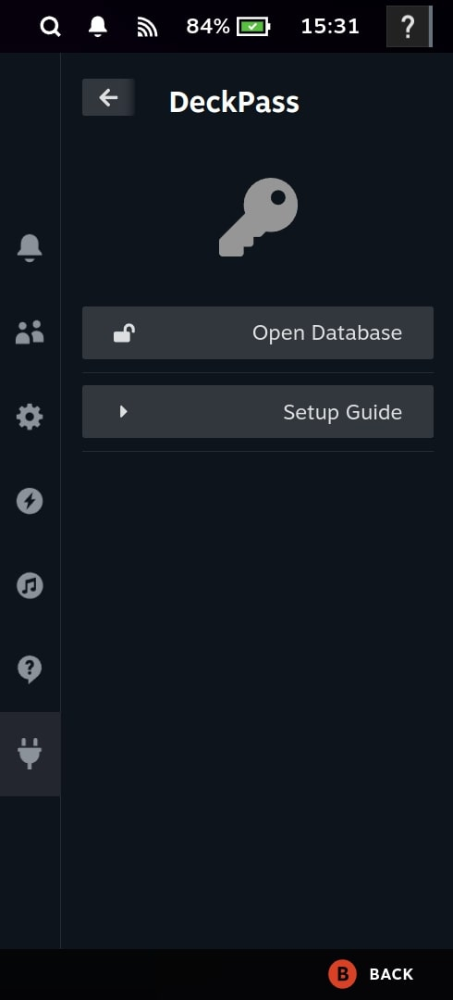
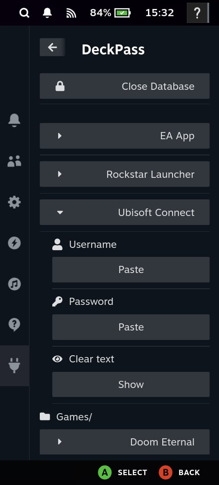

# DeckPass
DeckPass is a Decky Plugin to access passwords directly in SteamOS gaming mode.
Interally it uses KeePassXC.

## Plugin Setup
1. You can install the Plugin in two ways:
    1. Download the Plugin from the Decky Plugin Store (Not available yet)
    2. Build the plugin yourself
2. Open DeckPass in the Steam Quick Access Menu
3. For the first time setup either follow the Setup Guide within the plugin or the steps described here:
    1. Go to Desktop mode
    2. Install the KeePassXC (`org.keepassxc.KeePassXC`) flatpack
        - Either via Discover store
        - Or by running flatpak `flatpak install --user flathub org.keepassxc.KeePassXC`
    3. Open KeePassXC and create a new Database with a password
    4. Add your entries. You can edit the Database later as often as you want
    5. Save the Database under the DeckPass folder within your user directory under the `DeckPass` folder (e.g. `/home/deck/DeckPass`)
    6. Database path could look like this then: `/home/deck/DeckPass/passwords.kdbx`

## Security considerations
1. DeckPass serves only as a frontend for KeePassXC and itself does not store any credentials persistently
2. Once a database was opened, it stays open as long as KeePassXC decides it stays open
3. You can always close the Database manually as soon as you want

## Communication between DeckPass and KeePassXC
The flow of communication between DeckPass and KeePassKC works in the following way:

### Database opening
1. Python backend checks if the KeePassXC flatpack contains `keepassxc-cli` by calling the program once
2. Python backend checks if a .kdbx file is stored under the DeckPass folder
3. If conditionas (1) and (2) apply, the database can be opened via a password
4. The password will be entered into an input element and then sent in plain text to the python backend
5. The Python backend starts the `keepassxc-cli` via the KeePassXC Flatpack as subprocess with the open command and the found database file
6. When the CLI asks for the database password, it will be sent to the CLI by writing to stdin
7. After step (6) the database password will be not used at all anymore and also not stored anyhwere in the DeckPass frontend or Python backend

### KeyPassXC CLI command exchange
1. Once the database was opened with a correct password KeyPassXC is in charge of all credential related security regarding memory protection
2. Python Backend keeps the CLI process open until either KeyPassXC decides to close it or it was explicitly closed by the user via the frontend
3. Python Backend then sends CLI commands via stdin to the process and reads results from stdout

### Credential details and pasting
1. **Credential showcase in DeckPass**
    1. Python Backend requests clear text credentials from KeyPassXC CLI
    2. Frontend displays credentials
    3. Credentials are only stored in memory as long as the credentials are displayed
2. **Credential pasting to other applications**
    1. Python Backend requests clear text credentials from KeyPassXC CLI
    2. Frontend closes the Quick Access Menu
    3. Frontend simulates Keyboard Input for the current application by calling `SteamClient.Input.ControllerKeyboardSendText(credential)`