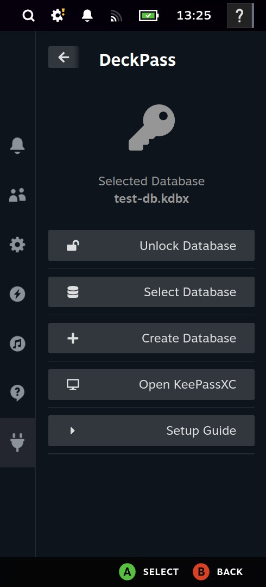
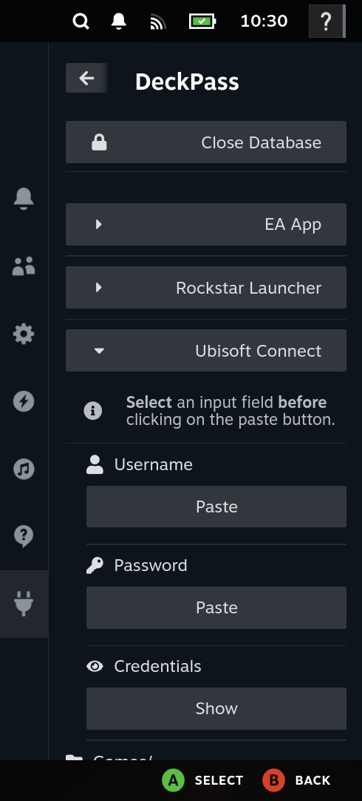
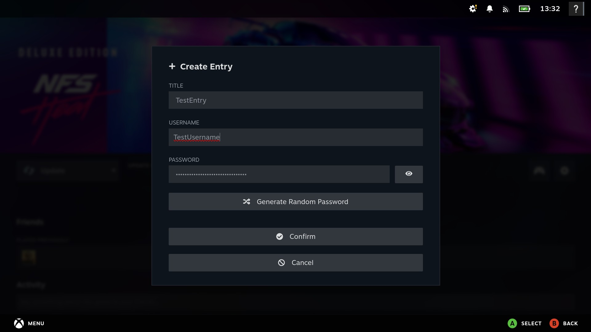
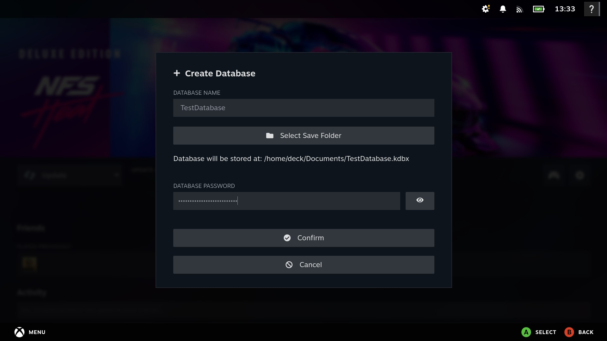

# DeckPass
DeckPass is a Decky Plugin to access passwords directly in SteamOS gaming mode.
Internally it uses KeePassXC.

## Plugin Setup
1. You can install the Plugin in two ways:
    1. Download the plugin from the Decky Plugin Store (Not available yet)
    2. Install the plugin from the releases page
    3. Build the plugin yourself
2. Open DeckPass in the Steam Quick Access Menu
3. Follow the Setup Guide displayed in the plugin menu
4. If installing the KeePassXC Flatpak via the button fails you have the following options:
    1. Install the KeePassXC Flatpak manually via the Discover Store
    2. Or ŕun the following command `flatpak install --user flathub org.keepassxc.KeePassXC`

## Known issues
1. When using Big Picture mode in Desktop mode, credential pasting does only work within the Steam interface, but not within games
2. Due to a limitation of KeePass, entries which have the same name within the same folder are not being displayed

## Security considerations
1. DeckPass is creating an interactive KeePass CLI process internally and therefore does not manage or store any credentials itself persistently
2. The KeePass CLI stays active as long as either the CLI itself closes it, or the users closes it via UI
3. DeckPass uses the following methods to reduce attack surface
    1. When creating the KeePass CLI process, direct parent to child process communication via pipes is used to communicate between Python backend (parent) and KeePass CLI process (child)
    2. After the opening a database, the frontend recieves a security token which is required for KeePass command execution for the backend
        1. The security token is stored in a scoped variable of the JavaScript module of the plugin
        2. This reduces the possibility that a process achieves to perform calls directly to the Python backend
4. If there is a malicious program or Decky plugin installed it might be able to interact with the running KeePass CLI process under cerain conditions
5. The detailed communication flow can be seen below 

## Communication between DeckPass and KeePassXC
The flow of communication between DeckPass and KeePassKC works in the following way:

### Database opening
1. Python backend checks if the KeePassXC flatpack contains `keepassxc-cli` by calling the program once
2. If condition (1) applies, the database can be opened via a password
3. The password will be entered into an input element and then sent in plain text to the python backend
4. The Python backend starts `keepassxc-cli` via the KeePassXC Flatpack as subprocess with the open command and the database file
5. When the CLI asks for the database password, it will be sent to the CLI by writing to stdin
6. After step (6) the database password will be not used at all anymore and also not stored anyhwere in the DeckPass frontend or Python backend
7. Python backend generates a short term token using `secrets.token_urlsafe(32)`, stores it in memory and returns it to the frontend
8. Frontend stores the token in a variable of the JavaScript module of the plugin

### KeePassXC CLI command exchange
1. Python Backend keeps the CLI process open until either KeePassXC decides to close it or it was explicitly closed by the user via the frontend
2. The the flow for command exchang works like this
    1. Frontend resolves the short term token it got from database opening
    2. Frontend makes a BE call including the token to request data
        1. E.g. Receiving credentials in clear text for an entry
    3. Backend compares the incoming token with the token in memory using `hmac.compare_digest`
    4. Backend sends the respective command to the open KeePass CLI process
    5. Backend waits for the response of the CLI and returns it to the frontend
    6. Frontend displays the response

### Credential details and pasting commands in detail
1. **Credential showcase in DeckPass**
    1. Python Backend requests clear text credentials from KeePassXC CLI
    2. Frontend displays credentials
    3. Credentials are only stored in memory as long as the credentials are displayed
2. **Credential pasting to other applications**
    1. Python Backend requests clear text credentials from KeePassXC CLI
    2. Frontend closes the Quick Access Menu
    3. Frontend simulates Keyboard Input for the current application by calling `SteamClient.Input.ControllerKeyboardSendText(credential)` for each character of the credential

## Building and Deployment

To properly build and deploy the plugin manually please refer to this guide: https://magicpods.app/blog/post-11/

# Acknowledgments
1. Release workflow taken from https://github.com/aarron-lee/SimpleDeckyTDP/blob/main/.github/workflows/release.yml
2. Steam Shortcut assets under `./assets/shortcut` are taken from https://www.steamgriddb.com/
